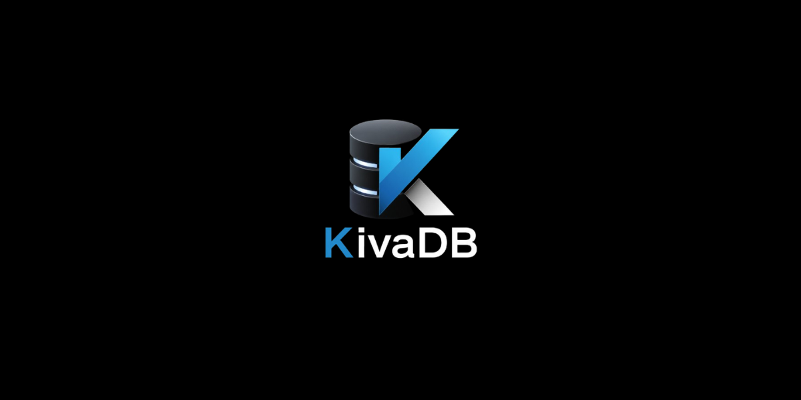

  

# KivaDB (v2.1.8)

KivaDB is a lightweight, high-performance NoSQL Key-Value database engine built with a hybrid C/C++ architecture. It combines the low-level efficiency of C for storage operations with the power of C++ STL structures for advanced memory-mapped indexing, validation, and dynamic TTL (Time To Live) management.

Designed for embedded or local operational velocity, KivaDB utilizes an Append-Only File (AOF) transactional logging strategy and an in-memory directory schema to guarantee immediate, predictable lookup performance.

## Key Features

* **Hybrid Architecture Engine**: Core persistence, disk serialization, and storage formats implemented in optimized C11; structural indexing and shell logic decoupled into type-safe C++17.
* **Persistent Index Telemetry**: Data persistence across application cycles using a robust binary format with a signature-based header validation (`KIVA`).
* **Persistent Horodatage**: Native transactional tracking of creation and modification dates embedded directly into disk records and mapped seamlessly to the active directory.
* **Dynamic TTL & Sliding Session Management**: Native tracking for expiring keys, featuring real-time cumulative incrementing (`add`) or structural resets (`set`) via high-speed atomic memory updates.
* **Smart Lazy Deletion**: Automated key invalidation triggered during boot recovery sequences or upon explicit record lookup phases, minimizing CPU overhead.
* **Type Inference Framework**: Built-in validation constraints for structured `String`, `Number` (integers/floats), and `Boolean` types.
* **Deterministic Name Validation**: Implementation of strict layout policies prohibiting purely numeric key identifiers to prevent logical indexing overlaps.
* **Advanced Command Shell**: A feature-rich CLI environment supporting string literal delimiters (`""`, `''`), key backticks (`` ` ``), keyword safety guards, and functional command chaining.
* **Maintenance Suite**: Integrated subroutines for structural database scanning, low-overhead memory mapping, real-time disk fragmentation auditing, and zero-downtime database file compaction.

## Architecture

KivaDB isolates system responsibilities into three distinct operational boundaries:

1. **The Shell Environment (CLI)**: Interprets user instructions, governs token syntax parsing via an advanced lexer, and handles direct user-space routing.
2. **The Index Layer (C++)**: Utilizes a highly efficient `std::unordered_map` hash table to map unique keys directly to physical file offsets (`int64_t`) and metadata configurations in $O(1)$ constant time.
3. **The Core Storage Engine (C)**: Manages pure sequential binary I/O operations, disk compaction, database telemetry, and structural format validation (V2 Format).

## Command Reference Manual

<table>
    <thead>
        <tr>
            <th>Command</th>
            <th>Description</th>
            <th>Example Syntax</th>
        </tr>
    </thead>
    <tbody>
        <tr>
            <td><strong>set</strong></td>
            <td>Stores a key-value record. Accepts optional TTL limits in seconds. Supports command chaining.</td>
            <td><code>set user_session "Active" ttl 3600</code></td>
        </tr>
        <tr>
            <td><strong>bump</strong></td>
            <td>
                <strong>Dynamic TTL Modifier:</strong> Alters the expiration threshold of an existing key without rewriting its underlying value payload.
                 <em>Modes: <code>set</code> resets the TTL to a fixed duration (Sliding Session); <code>add</code> aggregates time cumulatively. Supports optional type verification.</em>
            </td>
            <td>
                <code>bump user_session set 3600</code> 
                <code>bump string user_session add 600</code>
            </td>
        </tr>
        <tr>
            <td><strong>get</strong></td>
            <td>Retrieves stored record payloads. Supports command chaining using <code>and</code> keywords.</td>
            <td><code>get user_session and login_retry</code></td>
        </tr>
        <tr>
            <td><strong>has</strong></td>
            <td>Validates structural key existence or filters by type constraints. Supports chaining with <code>and</code>.</td>
            <td><code>has string user_session and has login_retry</code></td>
        </tr>
        <tr>
            <td><strong>update</strong></td>
            <td>Modifies an existing record value while enforcing structural type-safety guarantees.</td>
            <td><code>update login_retry 5</code></td>
        </tr>
        <tr>
            <td><strong>change</strong></td>
            <td>
                <strong>Refactoring Subroutine:</strong> Renames key pointers or migrates data types.
                 <em>Transactional Integrity: Ensures zero data loss if migration fails midway.</em>
            </td>
            <td>
                <code>change active_id to session_id</code> 
                <code>change session_id to system_id "sys-99"</code> 
                <code>change string legacy_code to number system_code 1044</code>
            </td>
        </tr>
        <tr>
            <td><strong>print</strong></td>
            <td>
                <strong>Evaluation Utility:</strong> Computes arithmetic expressions or executes string interpolations.
                 <em>Grammar Rules: Supports bracket priority <code>( )</code>, arithmetic operators <code>+ - * /</code>, and <code>${key}</code> interpolation.</em>
            </td>
            <td>
                <code>print (4 + 8) * 10</code> 
                <code>print "Connected to node: ${node_name}"</code> 
                <code>print "Logs:", system_id</code>
            </td>
        </tr>
        <tr>
            <td><strong>typeof</strong></td>
            <td>Extracts and displays the current registered type signature (<code>string</code>, <code>number</code>, <code>boolean</code>).</td>
            <td><code>typeof user_session</code></td>
        </tr>
        <tr>
            <td><strong>del</strong></td>
            <td>Appends a tombstone deletion marker for individual keys, or purges the complete storage tree.</td>
            <td><code>del legacy_code</code> or <code>del all keys</code></td>
        </tr>
        <tr>
            <td><strong>scan</strong></td>
            <td>Outputs a real-time matrix of the memory index: keys, type descriptors, raw byte sizes, and local creation timestamps or remaining TTL boundaries.</td>
            <td><code>scan</code></td>
        </tr>
        <tr>
            <td><strong>stats</strong></td>
            <td>
                <strong>Telemetry Dashboard:</strong> Monitors engine operational health, displaying active key count, database path, precise RAM footprint consumed by the map, and the <strong>live disk fragmentation ratio</strong>. 
                 <em>Features a diagnostic prompt <code>[Action Needed: 'compact']</code> if fragmentation breaches $\ge 20\%$.</em>
            </td>
            <td><code>stats</code></td>
        </tr>
        <tr>
            <td><strong>compact</strong></td>
            <td>Performs an on-line defragmentation of the <code>.kiva</code> file, discarding tombstones and historical logs to minimize disk wastage and restore the fragmentation ratio to 0.0%.</td>
            <td><code>compact</code></td>
        </tr>
        <tr>
            <td><strong>clear</strong></td>
            <td>Flushes the interface output using standard system console instructions.</td>
            <td><code>clear</code></td>
        </tr>
    </tbody>
</table>

## Binary File Layout Specifications (Format V2)

Database instances serialize sequentially into a raw `.kiva` binary stream, ensuring cross-platform stability through strict data alignment layouts:

### Global File Header Structure (12 Bytes)
* **Magic Signature** (4 Bytes): Character array matching `KIVA`.
* **Format Version** (4 Bytes): 32-bit unsigned integer defining structural encoding layer (set to `2` for V2).
* **Reserved Boundary** (4 Bytes): Aligned null-padded buffer reserved for transactional sequence numbering or future extensions.

### Individual Record Structure (Data Entry Block)
When records are written, updated, or marked for deletion, they are appended using a layout consisting of a **24-byte fixed binary header overhead** followed by the variable payload segments:

| Field Name | Data Type | Byte Boundary | Description |
| :--- | :--- | :--- | :--- |
| **k_size** | `uint16_t` | 2 Bytes | Length constraint of the target Key string |
| **v_size** | `uint32_t` | 4 Bytes | Length constraint of the Value string payload (`0` denotes an active Tombstone) |
| **type** | `uint8_t` | 1 Byte | Data type identifier mapping to native Enum structures |
| **timestamp** | `int64_t` | 8 Bytes | 64-bit Unix epoch indicating exact record instantiation or write time |
| **expires_at** | `int64_t` | 8 Bytes | 64-bit Unix timestamp limit for TTL validation (`0` denotes permanent persistence) |
| **padding** | `uint8_t` | 1 Byte | Internal padding block to guarantee structured 24-byte header alignment |
| **key** | `char[]` | `k_size` Bytes | Variable-length string representing the identifier key |
| **value** | `char[]` | `v_size` Bytes | Variable-length byte array or structured payload string |

> **Compatibility Warning**: Due to the introduction of persistent 8-byte key timestamps within the binary header block, data storage files generated by **KivaDB v2.1.5 or lower are incompatible** with the v2.1.6+ runtime engine. Please back up or purge old `.kiva` telemetry targets prior to starting a new session instance.

## License

This repository is published under and protected by the **[FomaDev Public License (FPL)](LICENSE)**.

* **Binary Utilization**: Permissions are granted to execute compiled KivaDB CLI binaries within personal, academic, and industrial production environments free of charge.
* **Source Modification**: Redistribution, compilation, or integration of source fragments into third-party commercial applications or competitive data frameworks requires an official paid licensing agreement.
* **Contributions**: Forks are exclusively permitted for creating pull requests targeting the primary branch of the official repository.

For more information, consult the comprehensive [LICENSE](LICENSE) text located at the project root directory.